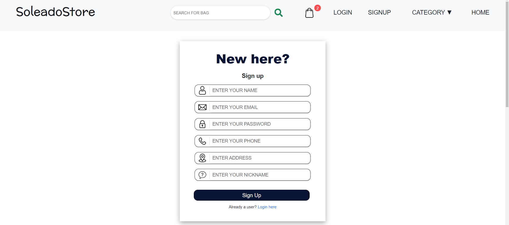
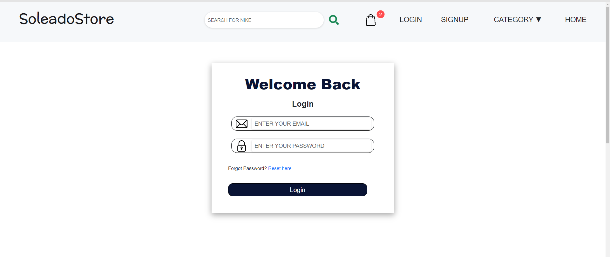

# SoleadoStore

The e-commerce website SoleadoStore is developed using Express, Node.js, Postgresql, and ReactJS. At SoleadoStore, you can shop in seven different categories, including books, electronics, watches, handbags, toys, household products, and shoes.
The website has a navbar, a main section with a shop now button that navigates the user to the products page, a bestsellers section, a features section, and a footer.

## Website features

this website has the following features: 

### `login, signup, and, reset password page`

New users are required to provide their information and sign up to proceed to checkout. On the other hand, existing users can simply log in with their credentials to continue shopping. In case an existing user forgets their password or is unable to log in with their login information, they can reset their password by providing the nickname they used when they signed up. 

### `All products page with filters`

This page displays products from all available categories. The users have an option to filter products based on category or price. 

### ` single category page`

This page displays products from any chosen category along with the number of products found.

### `single product page`

This page displays information of a single product. There's also an add to cart button enabling user to add the product to cart.

### `similar products section`

This section is just below the single product information. Products similar to the chosen product are displayed in this section. 

### `Cart page`

This page displays all products added to cart by the user and the total amount to be paid. 

### `User dashboard`

This section provides two options to the user. The user can either logout or edit their personal information.  

### `Admin dashboard`

This section is only for the admin. 
It enables the admin to create or update a category, create products, Update product information and view all products. 

### `Search results page`

This page displays all products related to your search.

### `contact us page`

This page consists of a google map displaying our location and also a form wherein the user can type in their message for us.

### `Not found page`

This page displays error 404 and navigates the user to the home page.
